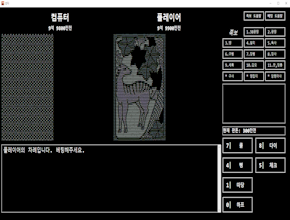
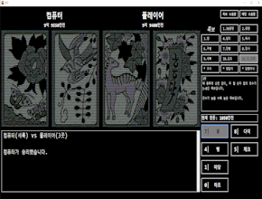

<h1>Seotta (섯다)</h1>
윈도우 폼을 사용한 간단한 섯다 게임입니다. 
플레이어와 CPU가 패를 뽑아 승자를 결정합니다.

## 스크린샷

|  |  |
|:---:|:---:|
| 패 확인 화면 | 베팅 결과 화면 |

## 개요
- **개발 기간:** 2024.03.14 ~ 2024.03.27 (약 2주)
- **프로젝트 유형:** 개인 프로젝트

## 주요 기능
- **패 뽑기 및 족보 비교**: 패를 뽑아 족보를 비교하여 승자를 결정.
- **베팅 시스템**: 하프, 콜, 다이 등의 베팅 옵션을 통해 게임 진행.
- **게임 진행 및 재시작**: 게임 종료 후 재경기 가능.
